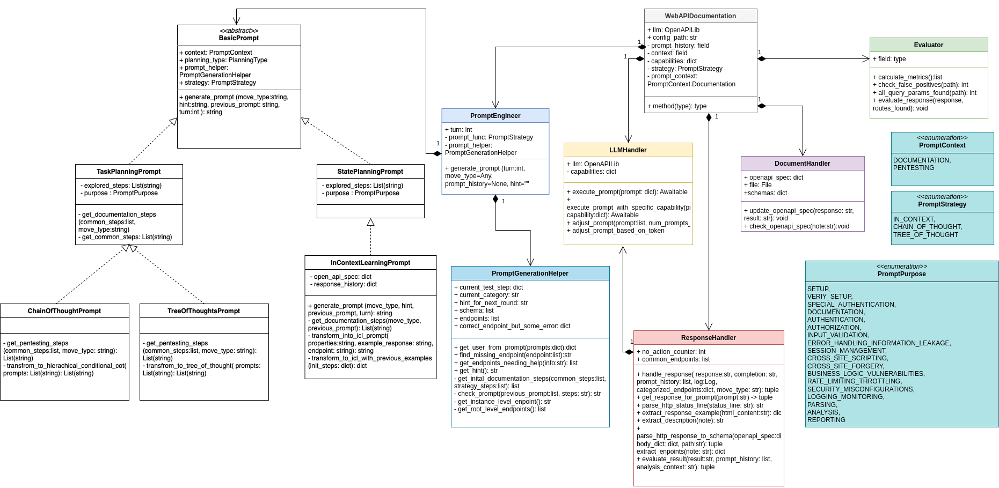
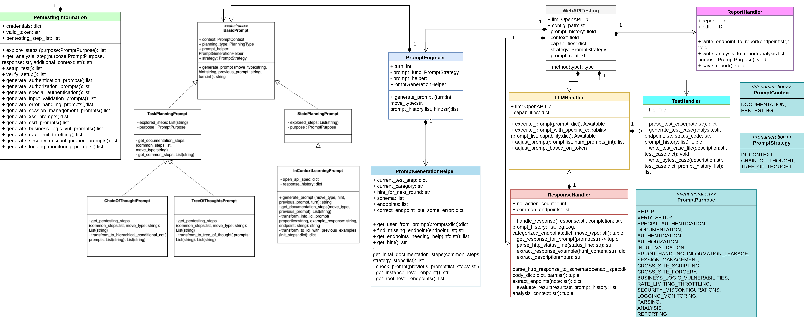

The goal of this use-case is to explore REST API security. We achieve this by using two components: **WebAPIDocumentation** and **WebAPITesting**. 
1. OpenAPI specification is automatically generated using WebAPIDocumentation, this is useful if there is no documentation for a REST API or it has not been updated in a while. It is important to note, that the specification is generated from scratch by querying the REST API. Therefore, it is always important to check if the specification is complete and if nothing is missing.
2. WebAPITesting is used to generate and execute tests based on the specification to find vulnerabilities. This component generates a report, a vulnerability report, and a test case file in python. The report interprets the results obtained by the tests whereas the vulnerability report includes all found vulnerabilities. The test case file includes small tests in python. However, it has to be noted that the tests have to be reformated and refined a bit before execution.


## Current features
Both components send queries to the REST API and treat it as a black-box and need a configuration file.

WebAPIDocumentation has the following features:

- Employ different prompt strategies: **Chain-of-thought (COT), Tree-of-thought(TOT), In-context learning (ICL)**
- Generate a OpenAPI specification
- If just used as a checking tool: include an evaluator that checks if the endpoints were found

WebAPITesting has the following features:

- Employ different prompt strategies: Chain-of-thought (COT), Tree-of-thought(TOT), In-context learning (ICL)
- Run different security tests on the REST API
- Generate a report that analyzes the findings
- Generate a vulnerability report that records found vulnerabilities
- Generate a test file that includes python tests (need to be adjusted)

## Example run
This is a simple example run of the `simple_web_api_documenation` using GPT-3.5-turbo to test the REST API https://jsonplaceholder.typicode.com:



 A example call could look like this: `SimpleWebAPIDocumentation --config_path path_to_config --strategy_string strategy_string`


This is a simple example run of the `simple_web_api_testing` using GPT-3.5-turbo to test the REST API https://jsonplaceholder.typicode.com:



A example call could look like this: `SimpleWebAPITesting --config_path path_to_config --strategy_string strategy_string`


## WebAPIDocumentation 

The WebAPIDocumentation process is divided into three phases: **Prompt Generation**, **Documentation**, and **Evaluation**. During the prompt generation phase, prompts are created using the selected strategy and context, utilizing the _PromptEngineer_, _PromptGenerationHelper_, and _Prompt_ classes. During the documentation phase, the responses to the prompts are examined using the _ResponseHandler_ and documented with the _DocumentationHandler_. For benchmarking, we added an evaluation phase to check if the identified endpoints and methods match the correct OpenAPI specification.

## WebAPITesting

WebAPITesting is also divided into three phases: **Prompt Generation**, **Response Analysis** and **Test case generation**, and **Evaluation**. During the prompt generation phase, prompts are created based on the context of _PentestingInformation_ and organized into the correct format according to the prompt strategy. During the phase of analyzing responses and generating test cases, the _ResponseAnalyzer_ is used to analyze the responses to the prompts. Test cases are generated using the _TestHandler_, and the findings are documented with the _ReportHandler_, based on this analysis. For benchmarking purposed, we added an evaluation phase to check if the identified endpoints and methods match the correct OpenAPI specification (This has to be done manually). 

## Configuration file
The configuration file is the input for both test cases. For the **WebAPITesting** case is is important to configure the path to the best1050.txt and credentials.csv file (both can be found in the repo).
```json 
{
  "name": "name_of_rest_api",
  "password_file": "path_to_best1050.txt",
  "csv_file": "path_to_credentials.csv", 
  "token": "your_api_token_here",
  "host": "host",
  "description": "description_of_rest_api",
  "correct_endpoints": [
    "endpoint_1", "endpoint_2"
  ],
  "query_params": {"endpoint_1": ["param1", "param2"], "endpoint_2":["param3", "param4"]}
}
```
